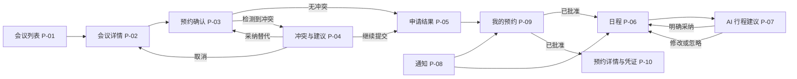
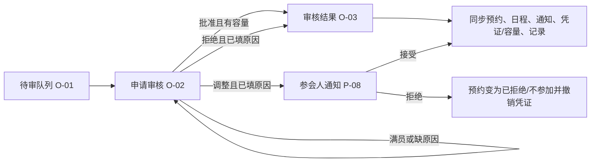
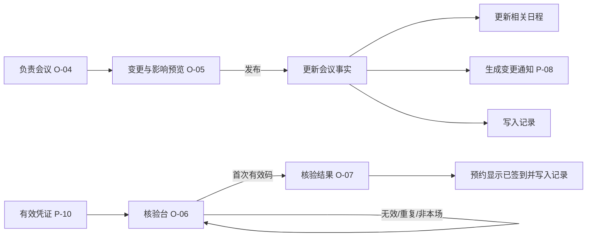

# GlobMeet 页面流程原型

**目的：** 用页面间的用户动作、状态变化与反馈表达 T2 原型；本文件补强以页面为维度的阅读方式，不取代 [prototype.md](prototype.md) 的完整状态表。

## 1. 参会人员主流程

### 1.1 页面转换规则

| 从页面 | 用户动作 | 到页面 | 即时反馈 | 数据效果 |
| --- | --- | --- | --- | --- |
| P-01 会议列表 | 点击会议 | P-02 会议详情 | 展示完整会议事实与本地时间 | 无 |
| P-02 会议详情 | 点击申请预约 | P-03 预约确认 | 显示申请摘要和规则 | 无 |
| P-03 预约确认 | 提交且无冲突 | P-05 申请结果 | 显示唯一编号与待审核状态 | 创建待审预约、队列项和记录 |
| P-03 预约确认 | 提交且有冲突 | P-04 冲突与建议 | 明确重叠会议、时间和影响 | 无 |
| P-04 冲突与建议 | 继续提交 | P-05 申请结果 | 说明会务将审核 | 创建待审预约并保留冲突依据 |
| P-04/P-06 | 请求建议 | P-07 AI 行程建议 | 显示理由、建议时段和影响 | 未采纳前不写入 |
| P-08 通知 | 接受调整 | P-06 日程 | 显示调整后的时间/地点 | 更新预约与日程 |
| P-08 通知 | 拒绝调整 | P-09 我的预约 | 显示已拒绝/不参加原因 | 撤销凭证、通知会务、写入记录 |
| P-09 我的预约 | 取消符合条件预约 | P-09 我的预约 | 显示取消影响与结果 | 移除待审项或归还名额，撤销日程/凭证并通知 |

## 2. 会务审核与同步流程

### 2.1 审核决定的页面反馈

| 决定 | 前置校验 | 会务页面反馈 | 对参会人页面的影响 |
| --- | --- | --- | --- |
| 批准 | 会议未满员 | O-03 显示批准与同步预览 | 我的预约变已批准；日程出现；通知可见；凭证有效 |
| 拒绝 | 必须填写原因 | O-03 显示拒绝原因与记录入口 | 我的预约变已拒绝；通知解释原因；不生成凭证 |
| 调整 | 必须填写原因与新的会议信息 | O-03 显示等待参会人确认 | P-08 产生待确认调整；未接受前不覆盖原安排 |

## 3. 会议变更与现场核验流程

### 3.1 异常与恢复

| 页面 | 异常状态 | 用户应看到什么 | 可恢复路径 |
| --- | --- | --- | --- |
| P-01 | 无匹配会议 | 空状态与清除筛选 | 清除条件，返回会议列表 |
| P-03/P-04 | 重复申请、满员或冲突 | 原因、受影响会议和可选动作 | 返回详情、查看替代或继续提交审核 |
| O-02 | 满员、拒绝/调整未填原因 | 就地错误说明，保留当前输入 | 修改原因/选择其他决定 |
| P-08 | 调整请求 | 变更前后与接受/拒绝的后果 | 接受更新日程，拒绝变为不参加 |
| O-06 | 无效、过期、非本场或重复码 | 具体失败原因，重复码显示既有签到记录 | 更换正确码或继续核验下一人 |
| 任意页面 | 权限不足 | 当前角色与可访问模块说明 | 返回角色范围内的页面；不改变任何状态 |

## 4. 导航层级约束

1. P-01、P-06、P-08、P-09 是参会人员端的一级目的地；其他 P 页面只能从对象、通知或当前任务进入。
2. O-01、O-04、O-06 是会务人员端的一级工作区；审核详情、变更预览和核验结果均为二级状态页。
3. AI 建议、冲突处理、凭证、操作记录和角色切换均不可独立成为全局一级入口。
4. 每一次写入动作必须有可见的即时反馈和可追溯结果；取消或忽略不得产生隐性写入。
