# GlobMeet 产品功能架构图

**阶段：** T1 产品功能架构 / T4 同步待确认  
**性质：** 功能地图/信息架构，不定义页面跳转和交互反馈；相关流程将在 T2 定义。

```mermaid
flowchart TB
    G["GlobMeet 国际智能会议协同平台"]

    G --> A["参会人员端"]
    G --> O["会务工作台"]
    G --> M["系统管理"]
    G --> S["平台基础能力"]

    A --> A1["会议（一级）"]
    A1 --> A11["会议查询与筛选"]
    A1 --> A12["会议详情"]
    A1 --> A13["本地时区时间"]

    A --> A2["日程（一级）"]
    A2 --> A21["我的日程与冲突标记"]
    A2 --> A22["日期/时区切换"]
    A2 --> A23["AI 行程建议"]

    A --> A3["通知（一级）"]
    A3 --> A31["审核结果"]
    A3 --> A32["会议变更"]
    A3 --> A33["待确认调整"]

    A --> A4["我的（一级）"]
    A4 --> A41["我的预约与申请状态"]
    A4 --> A42["电子凭证"]
    A4 --> A43["语言/时区/演示角色偏好"]

    A1 --> A14["预约申请、冲突提示与替代建议"]

    O --> O1["待办（一级）"]
    O1 --> O11["待审申请"]
    O1 --> O12["批准、拒绝或调整"]
    O1 --> O13["容量与冲突校验"]

    O --> O2["会议（一级）"]
    O2 --> O21["会议变更发布"]
    O2 --> O22["参会人通知同步"]
    O2 --> O23["负责会议记录"]

    O --> O3["核验（一级）"]
    O3 --> O31["核验码输入或扫描"]
    O3 --> O32["签到结果"]
    O3 --> O33["重复与无效核验处理"]

    M --> M1["会议与演示数据"]
    M1 --> M11["会议配置查看"]
    M1 --> M12["角色规则查看"]
    M1 --> M13["全量操作记录"]

    M --> M2["权限与隐私"]
    M2 --> M21["角色边界"]
    M2 --> M22["最少必要信息展示"]

    S --> S1["国际化"]
    S1 --> S11["中文与 English"]
    S1 --> S12["上海、伦敦、纽约、东京"]

    S --> S2["业务状态"]
    S2 --> S21["预约与审核状态"]
    S2 --> S22["日程与通知同步"]
    S2 --> S23["操作可追溯"]

    S --> S3["演示数据边界"]
    S3 --> S31["本地预置数据"]
    S3 --> S32["浏览器内模拟状态"]
    S3 --> S33["不接入真实服务"]
```

## 模块说明与需求映射

| 一级模块 | 二级功能 | 使用角色 | 对应需求 | 优先级 |
| --- | --- | --- | --- | --- |
| 参会人员端 | 会议：查询、筛选、详情、本地时区时间、预约与冲突处理 | 参会人员 | REQ-001 至 REQ-005 | P0 |
| 参会人员端 | 日程：本地时区日程、冲突标记、日期切换、AI 行程建议 | 参会人员 | REQ-008 至 REQ-010 | P0 |
| 参会人员端 | 通知：审核结果、会议变更、待确认调整 | 参会人员 | REQ-007、REQ-011 | P0 |
| 参会人员端 | 我的：预约状态、电子凭证、语言/时区/演示角色偏好 | 参会人员 | REQ-004、REQ-007、REQ-009、REQ-012、REQ-016 | P0 |
| 会务工作台 | 待办：待审、批准/拒绝/调整、容量校验 | 会务人员 | REQ-006、REQ-007 | P0 |
| 会务工作台 | 会议：发布变更、通知同步、负责会议记录 | 会务人员 | REQ-011、REQ-015 | P0 |
| 会务工作台 | 核验：码识别、签到结果、异常处理 | 会务人员 | REQ-013 | P0 |
| 系统管理 | 会议与演示数据、角色规则、全量操作记录 | 系统管理员 | REQ-014、REQ-015 | P0 |
| 系统管理 | 权限与隐私：角色边界、最少必要信息展示 | 系统管理员 | REQ-014 | P0 |
| 平台基础能力 | 国际化：中英界面、四个演示时区 | 所有角色 | REQ-009 | P0 |
| 平台基础能力 | 业务状态：预约、日程、通知、审计记录 | 所有角色 | REQ-004、REQ-007、REQ-011、REQ-015 | P0 |
| 平台基础能力 | 本地演示数据与模拟边界 | 所有角色 | 第 6 节 数据与真实性边界 | P0 |
| 增强能力 | 收藏分享、等候名单、容量预警、运营统计、更多语言/主题 | 对应角色 | P1 范围 | P1 |

## 架构边界

- 模块按“谁使用、解决什么任务”划分；同一业务状态可被多个模块读取或更新。
- “系统管理”用于展示配置、权限与审计边界，并不要求在本期实现完整后台维护能力。
- AI 仅在会议冲突和日程决策点提供辅助建议，不拥有自动预约或自动改写日程的权限，也不作为一级模块。
- 操作记录、角色切换、凭证和冲突中心不属于全局一级导航；分别在处理结果/管理员、个人偏好、我的预约和当前对象页中出现。
- 实时音视频、真实账户、真实日历、真实通知、服务端持久化与跨设备同步不属于此架构。

## 与后续视图的关系

| 视图 | 后续要补充的内容 |
| --- | --- |
| T2 流程原型 | 为 P0 模块定义进入点、状态、操作、反馈、异常和恢复路径。 |
| T3 视觉设计 | 为参会人员端和会务工作台的关键状态定义页面层级、组件、响应式规则和视觉证据。 |
| T4 至 T6 运行实现 | 将模块映射为代码结构、预置数据、状态模型、直接预览入口和验证证据。 |
