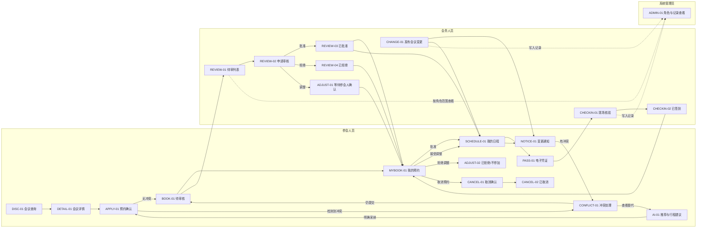

# GlobMeet 轻量流程原型

**版本：** T2 已确认 / T4 信息架构同步待确认  
**对应需求：** [requirements.md](requirements.md)（T1 已确认）  
**原型载体：** 状态流程图、状态表与操作反馈表

## 1. 原型范围

- **本轮验证目标：** 让评审在无需讲解补充的情况下，走完“查会议 -> 识别冲突 -> 提交预约 -> 会务审核 -> 日程/通知同步 -> 凭证核验”的跨角色闭环，并能理解国际化与 AI 建议如何影响决策。
- **覆盖：** `MEET-01`、`BOOK-01`、`REVIEW-01`、`SCHEDULE-01`、`CHANGE-01`、`CHECKIN-01` 及角色权限和操作记录。
- **不验证：** 视觉风格、正式文案、真实扫码识别、服务端刷新保持、真实音视频和外部系统集成。
- **演示身份：** 参会人员、会务人员、系统管理员可显式切换；每一次切换都保留当前演示身份提示。

## 2. 核心路径

```text
参会人员进入“会议”查询会议
  -> 查看详情与本地时区
  -> 发起预约
  -> 识别日程冲突后仍提交
  -> 收到待审核反馈
  -> 会务人员审核批准
  -> 日程、通知和凭证同步更新
  -> 会务人员现场核验
  -> 双方看到已签到与可追溯记录
```

## 3. 跨角色状态流程



### 3.1 导航层级约束

- 参会人员端的一级目的地仅为“会议、日程、通知、我的”：`DISC-01` 对应“会议”，`SCHEDULE-01` 对应“日程”，`NOTICE-01` 对应“通知”，`MYBOOK-01` 是“我的”的默认二级内容。
- 会务人员端的一级工作区仅为“待办、会议、核验”：`REVIEW-01` 归入待办，`CHANGE-01` 归入会议，`CHECKIN-01` 归入核验。操作记录进入个人菜单、处理结果或管理员页面。
- `AI-01`、`CONFLICT-01`、`PASS-01`、角色切换均为上下文状态，不能通过独立全局一级导航直达；AI 只从冲突处理或日程进入。
- 运行时可保留 `discover` 等稳定状态键，但对评审显示的导航文案必须使用上述名称。

## 4. 页面与状态

| 状态 ID | 用户目标 | 进入条件 | 可执行动作 | 即时反馈 | 数据/持久化变化 | 离开条件 |
| --- | --- | --- | --- | --- | --- | --- |
| DISC-01 | 查找适合的会议 | 参会人员从一级“会议”进入 | 搜索、筛选、切换语言/时区、打开详情 | 结果数和卡片即时更新；无匹配时显示空状态与重置 | 仅更新会话内筛选、语言、时区偏好 | 打开会议详情 |
| DETAIL-01 | 理解是否适合预约 | 从会议卡片进入 | 查看详情、时区对应时间、进入预约 | 显示容量、状态及可否预约；满员/已开始显示不可预约原因 | 无 | 进入预约确认或返回查询 |
| APPLY-01 | 提交预约申请 | 会议可预约且未重复申请 | 确认内容、提交申请 | 提交前检查必填和日程冲突 | 未提交前不改变预约数据 | 无冲突提交到 BOOK-01；有冲突进入 CONFLICT-01 |
| CONFLICT-01 | 在冲突下作出可控决定 | 与已确认日程有时间重叠，或会议变更造成冲突 | 取消本次申请、仍提交审核、查看替代建议 | 明示重叠会议、时间、影响及三种选择 | 取消不写入；仍提交创建待审申请；查看替代不改日程 | 返回 APPLY-01、进入 BOOK-01 或 AI-01 |
| AI-01 | 获得并控制 AI 建议 | 从冲突处理或日程入口进入 | 查看理由、采纳、修改、忽略建议 | 每条建议显示会议标签、时区/冲突说明和理由 | 只有明确采纳才更新草稿日程或返回预约确认；忽略不改数据 | 返回 APPLY-01 或 SCHEDULE-01 |
| BOOK-01 | 确认申请已送达 | 申请提交成功 | 查看申请编号、状态、转至我的预约 | 成功提示“待会务审核”，显示唯一编号 | 写入模拟申请、会务待审项和操作记录 | 进入 MYBOOK-01 |
| MYBOOK-01 | 跟踪本人预约结果 | 参会人员从一级“我的”默认页打开或收到审核结果 | 查看状态、接受/拒绝调整、取消符合条件的预约、打开已批准凭证 | 展示待审核/已批准/已拒绝/待确认/已签到/已取消及原因 | 接受调整后更新日程；拒绝调整后变为已拒绝/不参加，不恢复原预约 | 进入 SCHEDULE-01、PASS-01、ADJUST-02 或 CANCEL-01 |
| CANCEL-01 | 明确取消预约的影响 | 用户对待审核或未签到的已批准预约点击取消 | 确认取消或返回 | 显示状态、名额、日程、凭证及会务通知的影响 | 未确认前不改数据 | 确认进入 CANCEL-02；返回 MYBOOK-01 |
| CANCEL-02 | 确认取消已同步 | 用户确认取消成功 | 查看取消原因和后续说明 | 待审核申请从待审列表移除；已批准预约显示名额已归还、日程/凭证已撤销 | 预约变为已取消，更新容量、通知和操作记录 | 返回 MYBOOK-01 或会议查询 |
| SCHEDULE-01 | 管理本地时区下的行程 | 有已批准或待确认预约，或从一级“日程”进入 | 切换时区、打开通知、请求 AI 建议、进入会议/凭证 | 日程按当前时区排序；待确认和冲突显著标记 | 语言与时区为会话偏好；采纳 AI 建议才更新日程 | 进入 AI-01、NOTICE-01、PASS-01 或会议入口 |
| NOTICE-01 | 了解会议变更 | 会务发布变更后，相关参会人从一级“通知”打开 | 查看变更前后、标为已读、处理变更后的冲突 | 显示未读数、变更时间和受影响日程 | 已读状态和操作记录更新；会议数据已由会务动作更新 | 回到 SCHEDULE-01、MYBOOK-01 或 CONFLICT-01 |
| PASS-01 | 出示可核验预约凭证 | 当前预约为已批准且会议未取消 | 查看申请编号和模拟核验码 | 展示有效凭证；不符合资格时说明不可核验原因 | 无 | 由会务人员在 CHECKIN-01 核验 |
| REVIEW-01 | 找到需要处理的申请 | 会务人员进入工作台 | 筛选负责会议，打开申请详情 | 列表只显示可处理申请；空列表显示无待审 | 仅更新会话内筛选 | 进入 REVIEW-02 |
| REVIEW-02 | 以一致规则作出审核决定 | 打开待审申请 | 批准、拒绝、调整 | 显示申请详情、冲突、容量与必填原因 | 处理前不改数据 | 成功进入 REVIEW-03/04 或 ADJUST-01；满员/缺原因留在当前状态 |
| REVIEW-03 | 确认批准已同步 | 会务人员批准成功 | 查看结果、返回待审列表 | 成功提示，名额、参会人预约、日程、通知、凭证和记录同步 | 申请变为已批准，容量减少，写入通知和记录 | 返回 REVIEW-01 |
| REVIEW-04 | 确认拒绝已同步 | 会务人员拒绝成功 | 查看理由、返回待审列表 | 成功提示；参会人收到结果和理由 | 申请变为已拒绝，写入通知和记录 | 返回 REVIEW-01 |
| ADJUST-01 | 发出可确认的调整请求 | 会务人员选择调整并填写原因/新信息 | 提交调整 | 成功提示“等待参会人确认” | 写入调整内容、通知和记录；预约变为待确认 | 参会人员在 MYBOOK-01 接受或拒绝调整 |
| ADJUST-02 | 确认拒绝调整的结果 | 参会人员拒绝待确认的会务调整 | 查看原因和不参加结果 | 显示已拒绝/不参加，说明原预约不恢复 | 预约状态更新，凭证撤销，通知会务并写入记录 | 返回 MYBOOK-01 或会议查询 |
| CHANGE-01 | 发布会议变更并同步影响 | 会务人员打开负责会议 | 修改时间、地点、容量或议程并发布 | 发布前展示前后差异与受影响人数 | 更新会议、相关日程、未读通知和变更记录；有冲突则标记 | 参会人进入 NOTICE-01/SCHEDULE-01 |
| CHECKIN-01 | 安全完成现场核验 | 会务人员选择负责会议的核验入口 | 输入或扫描模拟码 | 有效码显示最少必要信息；无效/非本场/过期码解释原因 | 有效且首次核验才改变状态 | 有效码进入 CHECKIN-02；无效码留在当前状态 |
| CHECKIN-02 | 确认签到结果 | 有效预约首次核验成功 | 查看签到详情、继续核验下一人 | 显示已签到时间；重复码显示既有记录 | 预约变为已签到，写入会务记录 | 返回 CHECKIN-01 |
| ADMIN-01 | 检查权限与可追溯性 | 系统管理员进入管理入口 | 查看角色边界、全量模拟操作记录、会议配置摘要 | 高风险操作不可在此直接代办；记录按时间排序 | 仅更新会话内查看状态 | 返回上级模块或角色切换 |

## 5. 操作反馈

| 操作 ID | 所在状态 | 用户操作 | 即时反馈 | 成功结果 | 失败/取消结果 | 需求依据 |
| --- | --- | --- | --- | --- | --- | --- |
| ACT-01 | DISC-01 | 应用筛选或切换时区 | 列表与时间立即重算 | 可进入目标会议详情 | 无结果可清除筛选 | REQ-001、REQ-002、REQ-009 |
| ACT-02 | APPLY-01 | 提交预约 | 校验必填与重复申请 | 创建 BOOK-01 待审申请 | 缺项/重复时不创建申请并指出原因 | REQ-004 |
| ACT-03 | CONFLICT-01 | 取消、仍提交或查看替代 | 高亮冲突和操作后果 | 按所选动作进入对应状态 | 取消回到详情/预约，不改数据 | REQ-005、REQ-010 |
| ACT-04 | REVIEW-02 | 批准申请 | 校验容量后显示处理中提示 | 进入 REVIEW-03，并同步日程、通知、凭证和记录 | 满员时不可批准，保留申请待审 | REQ-007 |
| ACT-05 | REVIEW-02 | 拒绝或调整申请 | 原因未填写时就地提示 | 写入拒绝结果或 ADJUST-01 请求 | 取消则保持待审 | REQ-007 |
| ACT-06 | CHANGE-01 | 发布会议变更 | 显示变更前后差异和受影响人数 | 同步会议、通知、日程与记录 | 取消不改会议；输入缺失时阻止发布 | REQ-011、REQ-015 |
| ACT-07 | AI-01 | 采纳、修改或忽略建议 | 每种选择即时显示对日程的影响 | 仅采纳动作更新草稿行程/预约路径 | 修改或忽略不自动改已确认日程 | REQ-010 |
| ACT-08 | CHECKIN-01 | 输入或扫描模拟核验码 | 显示核验中和最少必要信息 | 首次有效码进入 CHECKIN-02 | 无效、过期、非本场和重复码不重复签到 | REQ-013 |
| ACT-09 | ADMIN-01 | 尝试无权限高风险操作 | 隐藏或禁用并说明原因 | 无 | 不改变业务状态 | REQ-014 |
| ACT-10 | CANCEL-01 | 确认取消预约 | 显示取消影响与处理中提示 | 进入 CANCEL-02，并同步待审列表或容量、日程、凭证、通知和记录 | 返回则保留原预约；已签到等不符合条件时不允许进入取消确认 | REQ-016 |

## 6. 关键异常与边界状态

| 类型 | 是否需要 | 状态 ID | 用户如何恢复/继续 |
| --- | --- | --- | --- |
| 加载 | 是 | DISC-01、REVIEW-01、CHECKIN-01 的初始载入 | 演示预置数据加载时显示骨架/加载提示；完成后自动进入正常状态。 |
| 空数据 | 是 | EMPTY-01 无会议结果；EMPTY-02 无待审申请；EMPTY-03 无日程 | 提供清除筛选、返回会议查询或查看推荐的入口，不呈现空白页面。 |
| 输入错误 | 是 | APPLY-01、REVIEW-02、CHANGE-01 | 在字段附近解释缺项或不合法值，保留用户已输入内容。 |
| 冲突 | 是 | CONFLICT-01 | 明示冲突对象和时间，允许取消、仍提交审核或查看替代建议。 |
| 权限不足 | 是 | DENY-01 | 说明当前角色没有该操作权限，返回可访问模块，且不改变数据。 |
| 数量上限 | 是 | FULL-01 | 会议满员时禁止新申请和批准，保留查看详情与替代建议入口。 |
| 变更影响 | 是 | NOTICE-01、SCHEDULE-01 | 显示变更前后和冲突标签，引导到冲突处理或日程查看。 |
| 无效/重复核验 | 是 | CHECKIN-01 | 显示具体失败原因；重复码只显示原签到记录，不写入第二次签到。 |
| AI 不采纳 | 是 | AI-01 | 用户可忽略或修改，系统不自动改变已确认日程。 |
| 取消资格不足 | 是 | CANCEL-01、DENY-01 | 已签到、已拒绝、已取消预约不显示取消入口；直接访问时说明不可取消原因。 |

## 7. 流程确认记录

- **承接的已确认规则：** 会务审核、冲突不自动覆盖、中英界面、四时区、本地规则 AI、浏览器内模拟数据、三类角色权限与全程可追溯。
- **本轮流程草案：** 预约冲突可仍提交；会务处理结果同步到预约、日程、通知、凭证和记录；发布变更会更新受影响日程；核验只对首次有效码写入签到。
- **明确排除的路径：** 真实登录、外部日历同步、推送、真实扫码、真实音视频、实时协同和跨设备同步。
- **待视觉解决的问题：** 移动端中角色切换、时区/语言切换、冲突提示、AI 理由、变更前后对比和核验码的清晰层级；桌面会务工作台与移动参会端的响应式变换。
- **已确认技术边界：** 刷新后的虚构 Demo 状态采用版本化 `localStorage` 保持，提供重置与种子场景入口；模拟码由前端预置/生成，时间格式化使用浏览器标准国际化能力，演示数据为本地结构化数据。
- **本轮确认补充：** 待审核或未签到的已批准预约可以取消；已批准取消归还名额、撤销凭证与日程、通知会务并写入记录。参会人员拒绝会务调整时，预约变为已拒绝/不参加，不恢复原预约，通知会务并撤销凭证。
- **语言展示补充：** 中文为默认演示语言，所有会议标题在列表、详情、冲突、日程、通知和会务记录中均显示中文；用户选择 `English` 后才显示对应英文会议标题。语言切换不改变预约或审核状态。
